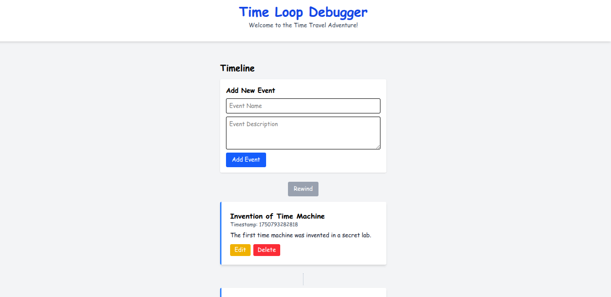

# Time Loop Debugger

A **React** application that simulates **time travel paradoxes** and how to resolve them. This interactive timeline lets users **create**, **edit**, and **delete** events, while carefully managing the **dependencies** between them to avoid paradoxes.



---

## 🚀 Features

- **📝 Event Management** – Create, edit, and delete timeline events
- **⚠️ Paradox Detection** – Alerts when a change may cause timeline inconsistencies
- **⏪ Time Rewinding** – Return to previous timeline states to fix paradoxes
- **🧠 Intuitive UI** – User-friendly interface with visual timeline representation

---

## 📋 Installation

```bash
# Clone the repository
git clone https://github.com/yourusername/time-loop-debugger.git

# Navigate to the project directory
cd time-loop-debugger

# Install dependencies
npm install

# Start the development server
npm run dev
````

---

## Live Link

* ([Live Link](timeloopdebugger.netlify.app))

---

## 🎮 How to Use

* **View Timeline** – See all events displayed in chronological order.
* **Add Events** – Use the form to create new events in the timeline.
* **Edit Events** – Modify any event by clicking the "Edit" button.
* **Delete Events** – Remove events carefully; altering the past may create paradoxes.
* **Fix Paradoxes** – Use the "Rewind" feature to go back to a stable timeline state.

---

## ⚙️ Implementation Details

* **Event Dependencies** – Lower ID events are considered prerequisites for later ones.
* **Paradox Detection** – Editing or deleting earlier events warns the user.
* **Timeline Management** – Maintains history for accurate rewinding.
* **State Management** – Utilizes React’s `useState` hooks for dynamic control.

---

## 🧩 Project Structure

```
src/
├── components/
│   ├── Event.jsx          # Displays and manages individual events
│   ├── EventForm.jsx      # Form component for adding/editing events
│   └── Timeline.jsx       # Handles event list and paradox logic
├── data/
│   └── sampleEvents.js    # Initial dummy event data
├── App.jsx                # Root application component
├── index.css              # Global styles (Tailwind CSS)
└── main.jsx               # App entry point
```

---

## 🔧 Technologies Used

* **React** – Frontend library for building UI
* **Tailwind CSS** – Utility-first styling framework
* **React Hot Toast** – For showing notifications (like paradox alerts)

---


## 📹 Demo

👉 *View Demo Video ([Video](https://youtu.be/nQ_2hH9REKs))*

---

## 📄 License

This project is licensed under the [MIT License](LICENSE).

---
